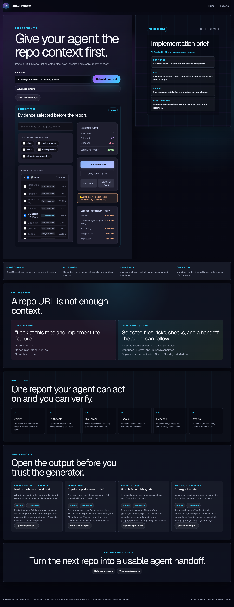

# Repo2Prompts

[](./LICENSE)
[](https://github.com/hbui290/repo2prompts/actions/workflows/ci.yml)

Turn any public GitHub repository into an evidence-backed brief for coding
agents.

Repo2Prompts analyzes repository structure, selects relevant files, cites exact
paths, tracks skipped evidence, and exports report-ready prompts for Codex,
Claude, Cursor, and other agent workflows.

[Documentation](./docs/README.md) · [Examples](./docs/EXAMPLES.md) · [Security](./SECURITY.md) · [Contributing](./CONTRIBUTING.md)



## Why it exists

Most repo-to-prompt tools stop at packing files into context. Repo2Prompts is
built for a stricter workflow:

- select evidence instead of dumping the whole repo
- cite files and keep agent handoff grounded
- score agent readiness from deterministic repository signals
- export reusable briefs, not just one-off prompts
- support self-hosted OpenAI-compatible model backends

## What you get

- Report types: `build`, `review`, `debug`, `migration`
- Scan depths: `fast`, `balanced`, `deep`
- Focused analysis mode for one specific question
- Deterministic Agent Readiness Score with next-step checklist
- Include/exclude evidence filters
- Markdown, JSON, and agent-specific export formats
- Stored report pages, static examples, and a badge endpoint
- Optional Supabase durable cache and brief library
- OpenAI-compatible JSON and SSE response parsing

## Quick start

```bash
npm run bootstrap
cp .env.example .env.local
npm exec pnpm dev
```

Open:

- `/` for the homepage generator
- `/workbench` for advanced analysis
- `/examples` for static sample reports without model setup

## Minimal config

```env
MODEL_BASE_URL=https://your-openai-compatible-endpoint/v1
MODEL_API_KEY=server-only-model-key
MODEL_CHAT_ID=chat-model-id
```

Optional:

```env
GITHUB_API_TOKEN=
MODEL_ANALYSIS_ID=
MODEL_WRITER_ID=
MODEL_REQUEST_TIMEOUT_MS=90000
DATABASE_REST_URL=
DATABASE_SERVICE_KEY=
RATE_LIMIT_WINDOW_MS=600000
RATE_LIMIT_MAX=10
NEXT_PUBLIC_SITE_URL=https://your-domain.example
```

`MODEL_ANALYSIS_ID` handles repository and module analysis. `MODEL_WRITER_ID`
handles brief writing and repair. Both fall back to `MODEL_CHAT_ID`.

## How analysis works

### Analysis depths

- `fast`: broad shortlist, up to 7 files, one writer call
- `balanced`: up to 20 files, builds or reuses a repository map, then writes
- `focused`: ranks evidence against one supplied question and caches a
  question-specific map
- `deep`: up to 35 files, analyzes up to 6 modules with bounded concurrency,
  merges the maps, writes, and may repair once

### Evidence model

Repo2Prompts does not reuse cached reports blindly. It computes an evidence
fingerprint from:

- source blob SHAs
- repository ref
- selected paths
- include/exclude filters
- selection policy

If the fingerprint changes, the generated brief is treated as stale and will
not be reused.

## Agent Readiness Score

Repo2Prompts scores generated reports from repository evidence without making an
extra model call.

It measures:

- documentation clarity
- setup clarity
- architecture clarity
- test visibility
- agent taskability
- risk and complexity

Reports include:

- deterministic score breakdown
- improvement checklist
- best next prompt for the agent
- detected verification commands
- basic rule-based safety warnings

Safety warnings are useful heuristics, not a security guarantee.

### Badge endpoint

```md
[](https://repo2prompts.com/library/report-id)
```

The badge reads the latest stored report for `owner/repo`. It does not generate
a new report, call GitHub, or call the model provider.

## Provider presets

Repo2Prompts is provider-neutral. Any gateway that supports OpenAI-compatible
`/chat/completions` can work with the same env names.

### Local gateway

Good for self-hosted local routing through any OpenAI-compatible proxy.

```env
MODEL_BASE_URL=http://127.0.0.1:20128/v1
MODEL_API_KEY=replace-with-local-gateway-key
MODEL_CHAT_ID=your-local-model-id
MODEL_ANALYSIS_ID=your-fast-local-model-id
MODEL_WRITER_ID=your-quality-local-model-id
```

### Groq

Good for fast or low-cost analysis. Verify available model IDs in your account
before production use.

```env
MODEL_BASE_URL=https://api.groq.com/openai/v1
MODEL_API_KEY=replace-with-groq-key
MODEL_CHAT_ID=llama-3.1-8b-instant
MODEL_ANALYSIS_ID=llama-3.1-8b-instant
MODEL_WRITER_ID=llama-3.3-70b-versatile
```

### OpenRouter

Good for provider flexibility. Free routes are useful for testing, but may be
rate-limited or weak for deep reports.

```env
MODEL_BASE_URL=https://openrouter.ai/api/v1
MODEL_API_KEY=replace-with-openrouter-key
MODEL_CHAT_ID=openrouter/free
MODEL_ANALYSIS_ID=openrouter/free
MODEL_WRITER_ID=replace-with-quality-model-id
```

### Gemini-compatible gateway

Repo2Prompts currently uses OpenAI-compatible chat completions. Use Gemini
through a compatible gateway unless native Gemini support is added later.

```env
MODEL_BASE_URL=https://your-gemini-compatible-gateway/v1
MODEL_API_KEY=replace-with-gateway-key
MODEL_CHAT_ID=gemini-compatible-model-id
MODEL_ANALYSIS_ID=gemini-compatible-fast-model-id
MODEL_WRITER_ID=replace-with-quality-writer-model-id
```

Recommended routing: use a fast model for `MODEL_ANALYSIS_ID` and a stronger
model for `MODEL_WRITER_ID`.

## Evidence filters

Advanced filters accept comma-separated path patterns:

```text
include: src/**, app/**, package.json
exclude: **/*.test.ts, dist/**, node_modules/**
```

## Run and verify

Bootstrap with the repo-local fallback that does not require global `pnpm`:

```bash
npm run bootstrap
```

Standard checks:

```bash
npm exec pnpm lint
npm exec pnpm test
npm exec pnpm build
```

For report-detail or homepage UI changes, use
`docs/REPORT_VISUAL_SMOKE.md` after `pnpm build`.

## Architecture

- `src/app`: Next.js App Router routes and API handlers
- `src/components`: report, homepage, workbench, and site chrome components
- `src/domain`: deterministic prompt, scoring, export, and shaping logic
- `src/integrations`: GitHub access, model calls, cache, logging, and rate
  limiting
- `docs`: deployment, security, examples, and architecture notes
- `scripts`: local bootstrap helpers

Read first:

- `docs/README.md`
- `docs/DEPLOYMENT.md`
- `docs/ARCHITECTURE.md`
- `docs/SECURITY.md`
- `docs/REPORT_VISUAL_SMOKE.md`
- `src/integrations/analysis-pipeline.ts`
- `src/domain/report-artifact.ts`

## Security

Repo2Prompts is designed for server-side deployment.

- Keep `MODEL_API_KEY`, `GITHUB_API_TOKEN`, and `DATABASE_SERVICE_KEY`
  server-only
- Do not place secrets in `NEXT_PUBLIC_*`
- Treat generated output as untrusted until checked against cited evidence
- For public deployments, prefer a database-backed limiter or upstream WAF

See [SECURITY.md](./SECURITY.md) for disclosure rules and
[`docs/SECURITY.md`](./docs/SECURITY.md) for the deeper policy.

## Support

- Bugs: open a GitHub issue with reproduction steps
- Product or UX ideas: open a feature request
- Security disclosures: use the process in [SECURITY.md](./SECURITY.md), not a
  public issue

## License

MIT.
